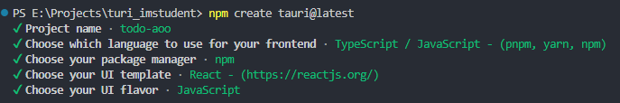

# Метод

## Создание простого Back-End

### Шаг 1: Установка необходимых инструментов

Перед тем, как начать разрабатывать, убедитесь, что у вас установлены следующие инструменты:

1. Node.js - платформа для выполнения JavaScript кода вне браузера.
2. npm (Node Package Manager) - менеджер пакетов для Node.js (поставляется вместе с Node.js)

[Скачать](https://nodejs.dev)

### Шаг 2: Инициализация проекта

Создайте новую папку для бекенда и перейдите в нее через терминал или командную строку.

```bash
mkdir notes-backend
cd notes-backend
```

### Шаг 3: Инициализация проекта и установка Express

Используя npm, инициализируйте проект и установите Express.

```bash
npm init -y
npm install express
```

### Шаг 4: Создание сервера с Express

Создайте файл `index.js` и подключите Express.

```javascript
// index.js
const express = require('express');
const app = express();
const port = 3000; // Вы можете использовать любой другой порт

// Добавьте промежуточное ПО (middleware) для обработки JSON
app.use(express.json());

// Простой массив для хранения заметок
let notes = [];

// Роут для получения всех заметок
app.get('/notes', (req, res) => {
  res.json(notes);
});

// Роут для создания новой заметки
app.post('/notes', (req, res) => {
  const { title, content } = req.body;
  const newNote = { title, content };
  notes.push(newNote);
  res.status(201).json(newNote);
});

// Роут для обновления существующей заметки
app.put('/notes/:id', (req, res) => {
  const id = parseInt(req.params.id);
  const { title, content } = req.body;
  const noteIndex = notes.findIndex((note) => note.id === id);

  if (noteIndex !== -1) {
    notes[noteIndex] = { id, title, content };
    res.json(notes[noteIndex]);
  } else {
    res.status(404).json({ error: 'Заметка не найдена' });
  }
});

// Роут для удаления заметки
app.delete('/notes/:id', (req, res) => {
  const id = parseInt(req.params.id);
  notes = notes.filter((note) => note.id !== id);
  res.status(204).end();
});

// Старт сервера
app.listen(port, () => {
  console.log(`Сервер запущен на порту ${port}`);
});
```

### Шаг 5: Запуск сервера

Запустите ваш сервер, выполнив следующую команду:

```bash
node index.js
```

Ваш backend для заметок с использованием Express должен быть доступен по адресу `http://localhost:3000` (или другому порту, если вы выбрали другой).

Теперь, когда вы успешно создали backend, вы можете использовать его в своем Tauri приложении.

## создание Tauri приложения

### Шаг 1: Установка Tauri
Установите Tauri CLI с помощью следующей команды:

```bash
npm install -g tauri
```

### Шаг 2: Создание нового Tauri приложения

Для создания нового Tauri приложения используйте:

```bash
npm create tauri@latest
```
В процессе создания укажите следующие настройки:



Это создаст новую папку, содержащую базовую структуру Tauri приложения.

### Шаг 3: Конфигурация Tauri приложения

Нужно настроить Tauri приложение в файле `tauri.conf.js`. Этот файл находится в папке src-tauri вашего проекта и позволяет управлять различными настройками, такими как иконки, заголовок окна, настройки безопасности и т. д.

Для того, чтобы разрешить приложению обращаться к серверу, добавьте конфигурацию в allowlist так, чтобы он выглядел следующим образом:

```json
"allowlist": {
    "all": false,
    "shell": {
        "all": false,
        "open": true
    },
    "http": {
        "request": true,
        "scope": ["http://localhost:3000/**"]
    }
},
```

Убедитесь, что в массиве scope присутствует адрес вашего backend'a.

### Шаг 4: Запуск Tauri приложения

Перейдите в папку вашего Tauri приложения и запустите его, используя команды:

```bash
npm install
npm run tauri dev
```

Это запустит ваше Tauri приложение в режиме разработки. При изменении файлов с кодом ваш проект будет автоматически перезапускаться.


### Шаг 5: Разработка

В папке 'src' вы найдёте JSX файлы - файлы React компонентов. Сейчас в файле 'App.jsx' сгенерированный код. Изменим его так, чтобы в нём остались стили, и наш компонент

### Шаг 5: Сборка Tauri приложения

Когда вы готовы опубликовать ваше Tauri приложение, вы можете выполнить команду:

```bash
tauri build
```

Это соберет ваше приложение для целевой платформы (например, Windows, macOS, Linux), и вы найдете файлы приложения в папке `src-tauri/target/release/bundle`.

Теперь у вас есть простое CRUD-backend с использованием Express и Tauri приложение, которое может взаимодействовать с этим бэкендом. Вы можете использовать Tauri для создания кросс-платформенных desktop-приложений, интегрирующих ваш CRUD-backend для заметок.