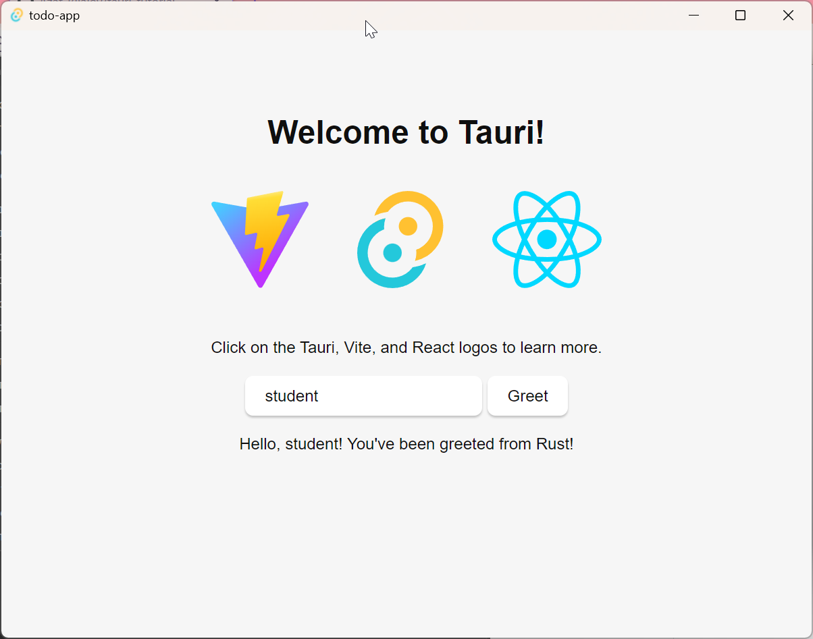
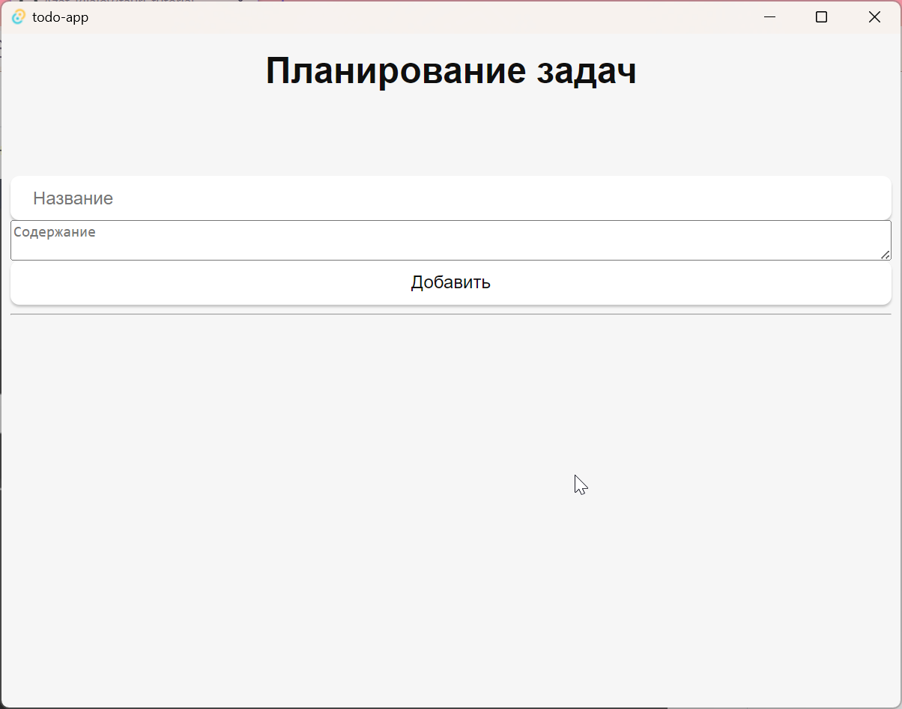

# Метод

## Создание простого Back-End

### Шаг 1: Установка необходимых инструментов

Перед тем, как начать разрабатывать, убедитесь, что у вас установлены следующие инструменты:

1. Node.js - платформа для выполнения JavaScript кода вне браузера.
2. npm (Node Package Manager) - менеджер пакетов для Node.js (поставляется вместе с Node.js)

[Скачать](https://nodejs.dev)

### Шаг 2: Инициализация проекта

Создайте новую папку для Backend'а и перейдите в нее через терминал или командную строку.

```bash
mkdir notes-backend
cd notes-backend
```

### Шаг 3: Инициализация проекта и установка Express

Используя npm, инициализируйте проект и установите Express.

```bash
npm init -y
npm install express
```

### Шаг 4: Создание сервера с Express

Создайте файл `index.js` и подключите Express.

```javascript
// index.js
const express = require('express');
const app = express();
const port = 3000; // Вы можете использовать любой другой порт

// Добавьте промежуточное ПО (middleware) для обработки JSON
app.use(express.json());

// Простой массив для хранения заметок
let notes = [];

// Роут для получения всех заметок
app.get('/notes', (req, res) => {
  res.json(notes);
});

// Роут для создания новой заметки
app.post('/notes', (req, res) => {
  const { title, content } = req.body;
  const newNote = { title, content };
  notes.push(newNote);
  res.status(201).json(newNote);
});

// Роут для обновления существующей заметки
app.put('/notes/:id', (req, res) => {
  const id = parseInt(req.params.id);
  const { title, content } = req.body;
  const noteIndex = notes.findIndex((note) => note.id === id);

  if (noteIndex !== -1) {
    notes[noteIndex] = { id, title, content };
    res.json(notes[noteIndex]);
  } else {
    res.status(404).json({ error: 'Заметка не найдена' });
  }
});

// Роут для удаления заметки
app.delete('/notes/:id', (req, res) => {
  const id = parseInt(req.params.id);
  notes = notes.filter((note) => note.id !== id);
  res.status(204).end();
});

// Старт сервера
app.listen(port, () => {
  console.log(`Сервер запущен на порту ${port}`);
});
```

### Шаг 5: Запуск сервера

Запустите ваш сервер, выполнив следующую команду:

```bash
node index.js
```

Ваш backend для заметок с использованием Express должен быть доступен по адресу `http://localhost:3000` (или другому порту, если вы выбрали другой).

Теперь, когда вы успешно создали backend, вы можете использовать его в своем Tauri приложении.

## Разработка Tauri приложения

### Шаг 1: Установка Tauri
Установите Tauri CLI с помощью следующей команды:

```bash
npm install -g tauri
```

### Шаг 2: Создание нового Tauri приложения

Для создания нового Tauri приложения используйте:

```bash
npm create tauri@latest
```
В процессе создания укажите следующие настройки:


При желании, можно выбрать другое имя проекта, Rust для разработки интерфейса, или другие инструменты, например Vue. 

Мы же покажем далее как использовать выбранные инструменты.

### Шаг 3: Конфигурация Tauri приложения

Нужно настроить Tauri приложение в файле `tauri.conf.js`. Этот файл находится в папке src-tauri вашего проекта и позволяет управлять различными настройками, такими как иконки, заголовок окна, настройки безопасности и т. д.

Для того чтобы разрешить приложению обращаться к серверу, добавьте конфигурацию в allowlist так, чтобы он выглядел следующим образом:

```json
"allowlist": {
  "all": false,
  "shell": {
    "all": false,
    "open": true
  },
  "http": {
    "request": true,
    "scope": [
      "http://localhost:3000/**"
    ]
  }
}
```

Убедитесь, что в массиве scope присутствует адрес вашего Backend'а.

### Шаг 4: Запуск Tauri приложения

Перейдите в папку вашего Tauri приложения и запустите его, используя команды:

```bash
npm install
npm run tauri dev
```

Это запустит ваше Tauri приложение в режиме разработки. При изменении файлов с кодом ваш проект будет автоматически перезапускаться.



### Шаг 5: Разработка

В папке `src` вы найдёте JSX файлы - файлы React компонентов. 


Сейчас в файле `App.jsx` сгенерированный код. Изменим его так, чтобы в нём остался только наш будущий компонент:

```jsx
import React from 'react';
import TodoListPage from './pages/TodoList';
import './styles.css';

function App() {
    return (
        <div className="App">
            <TodoListPage />
        </div>
    );
}

export default App;
```

Создадим папку `pages`, в которой будут размещены страницы нашего приложения. Добавим в папку компонент первой страницы `TodoList.jsx` - он будет отвечать за вывод списка задач и взаимодействие с ними. `TodoListPage` должен возвращать JSX-код, который [компилируется](https://ru.legacy.reactjs.org/docs/introducing-jsx.html) в вызовы `React.createElement()`, после чего полученные React-элементы [рендерятся](https://ru.legacy.reactjs.org/docs/rendering-elements.html) в DOM. Добавим в исходную фунцию `TodoListPage` вёрстку, и сделаем её экспортируемой по-умолчанию:


```jsx
import React, { useState } from 'react';

function TodoListPage() {
    // список всех задач
    const [todos, setTodos] = useState([]);

    // новая задача
    const [newTodo, setNewTodo] = useState({ title: '', content: '' });
    
    return (
        <div>
            <h1>Планирование задач</h1>
            <div className="container">
                <input
                    className="input-title"
                    type="text"
                    placeholder="Название"
                    value={newTodo.title}
                />
                <textarea
                    className="input-content"
                    placeholder="Содержание"
                    value={newTodo.content}
                />
                <button className="button-add button-lg">Добавить</button>
            </div>
            <hr />
            <div className="container">
                {todos.map((todo) => ( // Для каждой задачи из списка 
                    <div className="todo" key={todo.id}>
                        <h3 className='todo-title'>
                            {todo.title}
                        </h3>
                        <p className="todo-content">
                            {todo.content}
                        </p>
                        <button className='button-delete'>Удалить</button>
                    </div>
                ))}
            </div>
        </div>
    );
}

export default TodoListPage;
```

Теперь, если у нас запущено приложение в режиме разработки, и вы сохраните все файлы, то у вас должна быть следующая картина:



Так как приложение использует стили по умолчанию для своего шаблона, мы Отредактируем стили приложения `src/styles.css`:

<details>
<summary>Cтили `src/styles.css`</summary>

```css
/* styles.css */

/* Общие стили */
body {
  font-family: Arial, sans-serif;
  font-size: 16px;
  line-height: 1.5;
  color: #333;
  background-color: #f7f7f7;
  margin: 0;
  padding: 0;
}

.container {
  max-width: 800px;
  margin: 0 auto;
  padding: 20px;
}

h1 {
  text-align: center;
}

/* Стили для формы добавления заметок */
.input-title,
.input-content {
  display: block;
  width: 100%;
  margin-bottom: 10px;
  padding: 5px;
  font-size: 16px;
  border: 1px solid #ccc;
  border-radius: 5px;
}

.input-content {
  resize: vertical;
  min-height: 100px;
}

/* Стили для списка заметок */
.todo {
  background-color: #f7f7f7;
  border: 1px solid #ccc;
  border-radius: 5px;
  padding: 10px;
  margin-bottom: 10px;
}

.todo-title {
  margin-top: 0;
}

.todo-content {
  white-space: nowrap;
  overflow: hidden;
  text-overflow: ellipsis;
}

.button-add {
  background-color: #00bfff;
  color: #fff;
  border: none;
  padding: 5px 10px;
  border-radius: 5px;
  cursor: pointer;
  transition: background-color 0.3s ease-in-out;
}

.button-delete {
  background-color: #ff6347;
  color: #fff;
  border: none;
  padding: 5px 10px;
  border-radius: 5px;
  cursor: pointer;
  transition: background-color 0.3s ease-in-out;
}

.button-add:hover {
  background-color: #0099cc;
  transition: background-color 0.3s ease-in-out;
}

.button-delete:hover {
  background-color: #cc4635;
  transition: background-color 0.3s ease-in-out;
}

.button-lg {
  font-size: 16px;
}
```
</details>

Теперь приложение должно выглядеть следующим образом:


Заметим, что если вы попробуете что-нибудь написать в полях `Название` и `Содержание`, ничего не выйдет. В том числе, в консоли вы увидите следующее сообщение:


Дело в том, что мы отображаем состояние компонента, но никак его не меняем. Для того чтобы изменить состояние, нужно повесить триггер на событие изменения `OnChange`, в котором будет вызываться функция измения состояния:

```jsx
<div className="container">
  <input
      className="input-title"
      type="text"
      placeholder="Название"
      value={newTodo.title}

      onChange={(e) => setNewTodo({ ...newTodo, title: e.target.value })}
  />
  <textarea
      className="input-content"
      placeholder="Содержание"
      value={newTodo.content}

      onChange={(e) => setNewTodo({ ...newTodo, content: e.target.value })}
  />
  {/* Код кнопки */}
</div>
```

Теперь ввод работает:


Теперь займёмся добавлением логики, которая будет выполнятся после нажатия на кнопки.

```jsx
import React, { useState } from 'react';

const TodoListPage = () => {
    // список всех задач
    const [todos, setTodos] = useState([]);

    // новая задача
    const [newTodo, setNewTodo] = useState({ title: '', content: '' });

    // добавление новой задачи
    const handleAddTodo = () => {
        if (!newTodo.title || !newTodo.content) {
            console.error("Поля не должны быть пустыми");
            return;
        };
        const newTodoWithId = { ...newTodo, id: Date.now() };
        setTodos([...todos, newTodoWithId]);
        setNewTodo({ title: '', content: '' });
    };

    // удаление задачи
    const handleDeleteTodo = (id) => {
        const updatedTodos = todos.filter((todo) => todo.id !== id);
        setTodos(updatedTodos);
    };

    {/*return ( ... )*/}
}
```

Мы добавили две функции, изменяющие состояния при добавлении и при удалении заметки. Повесим их на события нажатия кнопок:
```jsx
<button className="button-add button-lg" onClick={handleAddTodo}>Добавить</button>
```
```jsx
<button className='button-delete' onClick={() => handleDeleteTodo(todo.id)}>Удалить</button>
```

Обратите внимание на то, как передаются аргументы функций. 


Теперь заметки добавляются и удаляются, настало время связаться с нашим сервером!


### Шаг 6: Сборка Tauri приложения

Когда вы готовы опубликовать ваше Tauri приложение, вы можете выполнить команду:

```bash
tauri build
```

Это соберет ваше приложение для целевой платформы (например, Windows, macOS, Linux), и вы найдете файлы приложения в папке `src-tauri/target/release/bundle`.

## Дополнительно: Добавление Middleware для сервера

Middleware - связующее ПО, которое помогает обмену запросов между приложением и сервером. Оно снижает зависимость от API, позволяет не торопиться с обновлением старого Backend'а и снижает нагрузку.

### Шаг 1: Логирование запросов

Для логирования запросов мы будем использовать библиотеку [morgan](https://github.com/expressjs/morgan). Чтобы ее установить, перейдите в директорию `server` и напишите в командной строке:

```bash
npm install morgan
```

### Шаг 2: Установка логгера

Логгер необходим для фиксации событий в работе веб-ресурса, которая помогает выявлять и исправлять в будущем баги системы или ее сбои.

В файле `index.js` импортируйте `morgan`:

```javascript
const express = require('express');
const app = expres();
const cors = require('cors');
// Импортируем библиотеку
const morgan = require('morgan');
// ... Остальной код
```

Далее добавляем логгер и устанавливаем в режим `'combined'` для более подробного получения данных:

```javascript
// ... Остальной код

app.use(cors());
app.use(express.json());
// Устанавливаем morgan в режим 'combined'
app.use(morgan('combined'));

// ... Остальной код
```

Теперь вы можете проверить работоспособность с помощью тестового запроса:

```bash
curl -X POST -H "Content-Type: application/json" -d '{"title":"Buy groceries"}' http://localhost:3000/todos
```

```bash
curl -X POST -H "Content-Type: application/json" -d '{"content":"Oppenheimer or Barbie???"}' http://localhost:3000/todos
```

### Шаг 3: Добавление валидации задач

После того как мы с помощью `curl` попробовали внести новые данные, можно обратить внимание, что они никак не обрабатываются, т.е. спокойно можно внести запись без заголовка, описания или абсолютно пустую запись.

Чтобы этого избежать, необходимо добавить еще один "слой" Middleware, перейдите в директорию `server` и пропишите в терминале:

```bash
mkdir middleware
```

После этого создайте в этой директории файл `validation.js`.

```javascript
const validateTodo = (req, res, next) => {
    const body = req.body;

    // Проверка наличия поля "title"
    if (!body.title) {
        return res.status(400).json({ error: 'Title is required' });
    }

    // Задаем значения по умолчанию для "content" и "completed"
    const content = body.content || '';
    const completed = body.completed || false;

    // Создаем объект с валидированными данными
    req.validatedTodo = {
        title: body.title,
        content: content,
        completed: completed
    };

    // Переходим к следующему обработчику
    next();
};

// Экспорт функции валидации
module.exports = {
    validateTodo
};
```

Здесь мы проверяем наличие поле title, если оно будет не заполнено, вернется ошибка с описанием `Title is required`.

Далее, если поля content и completed не заполнены, то мы заполняем их по умолчанию пустой строкой и `false` соответственно.

Функция `next()`, которую мы передаем вместе с параметрами, необходима для того, чтобы с видоизмененным запросом перейти к следующему обработчику.

### Шаг 4: Добавляем валидацию на POST-запрос

Перейдем в файл `/server/todos/app.js` и перепишем POST-запрос.

```javascript
const express = require('express');
const router = express.Router();

const todosController = require('./controller');
const validateTodo = require('../middleware/validation');

/*
*   GET-запрос.
*/

router.post('/', validateTodo, (req, res) => {
    const todo = todosController.postTodo(req.validatedTodo);
    res.send(todo);
});
```

1. Мы поменяли входные параметры, теперь обработчик принимает еще один параметр, нашу функцию `validateTodo`, которая валидирует (проверяет на корректность) запрос.

2. Теперь в метод контроллера мы отправляем свойство `req.validateTodo`, которое пришло к нам из `validateTodo`.

Если попробуем добавить какие-то некорректные данные, например:

```bash
curl -X POST -H "Content-Type: application/json" -d '{"content":"Buy fruits"}' http://localhost:3000/todos
```

Получаем на выходе ошибку:
```bash
{
  "error": "Title is required"
}
```

Теперь у вас есть простое CRUD-backend с использованием Express и Tauri приложение, которое может взаимодействовать с этим Backend'ом. Вы можете использовать Tauri для создания кросс-платформенных desktop-приложений, интегрирующих ваш CRUD-backend для заметок.
